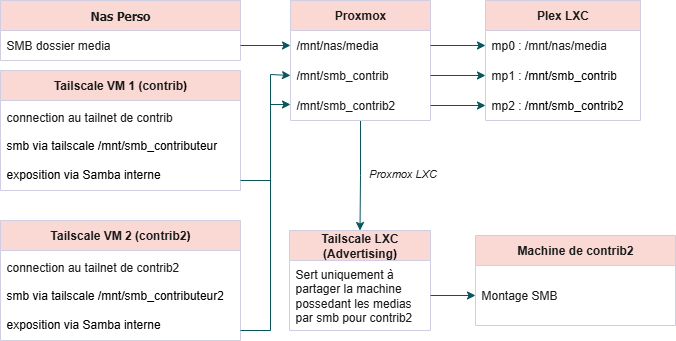
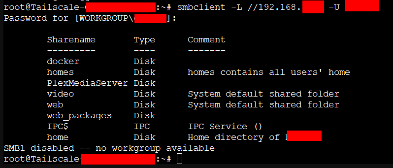
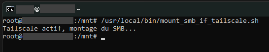
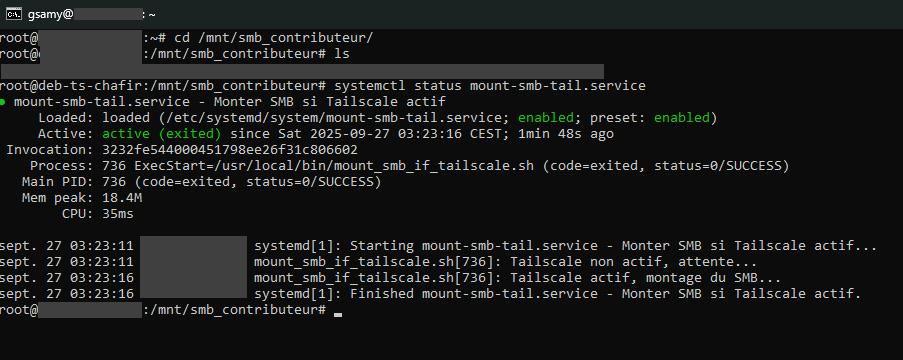
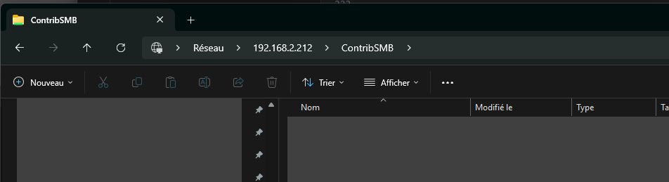
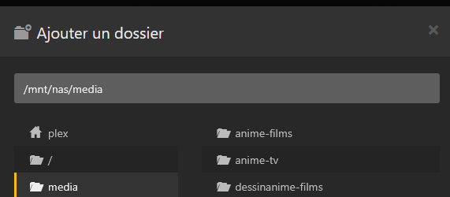

# Proxmox Multi-SMB via Tailscale

## Contexte

L'objectif est de partager le dossier des médias via SMB en passant par le tunnel Tailscale. Ainsi, Plex peut lire les fichiers directement et proposer d'immenses bibliothèques de contenu sans duplication, ce qui permet d'économiser beaucoup d'espace de stockage.

:::info Cas d'usage
Le système prend tout son sens lorsque plusieurs personnes participent au partage : chacun peut contribuer avec ses propres fichiers, et l'ensemble est rendu accessible à tous de manière transparente.
:::

## Contexte technique  
Nous avons finalement choisi d’utiliser une **VM** plutôt qu’un conteneur **LXC**.  
Même si une VM est en principe plus lourde qu’un LXC, dans notre cas la consommation de RAM reste proche, ce qui en fait un compromis acceptable tout en offrant plus de souplesse.  

En effet, l’utilisation de LXC présentait certaines limitations :  

- Dans un conteneur **non privilégié**, il n’était pas possible de monter directement un partage SMB et de remonter ensuite ce contenu sur l’hôte.  
- Cette contrainte était liée aux restrictions du kernel et à l’isolation propre aux conteneurs LXC.  

Pour contourner cette limite, la solution mise en place a été la suivante :  

1. **Monter le partage SMB dans la VM** (connexion via Tailscale en tunnel et montage du partage SMB défini dans le fstab).  
2. **Exposer ce montage via un serveur Samba** installé dans la VM, afin de rendre les données accessibles sur le réseau local ou depuis l’hôte.  


## Schéma d'architecture



## Prérequis

:::warning Vérifications importantes
Avant de commencer, assurez-vous d'avoir :
:::

- **1 conteneur LXC Tailscale (advertising)** : dédié exclusivement à la publication du subnet
- **1 VM Tailscale (Contrib)**: utilisé uniquement pour se connecter au tailnet du deuxième contributeur  
- **1 conteneur LXC Plex** : disposera, via des points de montage depuis l'hôte, d'un accès à plusieurs partages de contributeur

## Configuration initiale

### Créer un compte chez Tailscale

1. Rendez-vous sur [Tailscale](https://tailscale.com)
2. Créez votre compte

### Installer Tailscale LXC (Advertising)

:::tip Référence
Suivez le guide : [Installer le conteneur LXC Tailscale (Advertising)](../os/tailscale-installation-advertising)
:::

### Configuration Access Control

Allez dans Access Control puis ajouter le droit SMB :
[https://login.tailscale.com/admin/acls/file](https://login.tailscale.com/admin/acls/file)

Choisir le format JSON, voici un exemple :

```json title="ACL Configuration"
{
  "ACLs": [
    {
      "Action": "accept",
      "Users": [
        "contributeur@gmail.com"
      ],
      "Ports": [
        "192.168.x.x:139",
        "192.168.x.x:445"
      ]
    }
  ]
}
```

:::info
Ici, nous autorisons `contributeur@gmail.com` à accéder en SMB au serveur `192.168.x.x`.
:::


## Installer la VM Tailscale (Contrib)

:::tip Référence
Suivez le guide : [Installer la VM Tailscale (contrib)](../os/tailscale-installation-contrib)
:::

### Tester la disponibilité du serveur SMB de contrib

```bash
apt-get install smbclient
```

Test de connexion :

```bash
smbclient -L //192.168.x.x -U utilisateur
```

Exemple :



# Préparation et mise en place pour SMB

Installer les dépendances nécessaires pour le montage SMB :

```bash
apt-get install cifs-utils
```

Créer le répertoire de montage :

```bash
mkdir /mnt/smb_contributeur
```

Changer de propriétaire en 1000:1000 :

```bash
chown -R 1000:1000 /mnt/smb_contributeur 
```

Créer le fichier de credentials :

```bash
nano /root/.smbcredentialscontrib
```

Contenu :

```ini title="/root/.smbcredentialscontrib"
username=contrib
password=mot_de_passe_samba
```

Sécuriser le fichier :

```bash
chmod 600 /root/.smbcredentialscontrib
```

### Montage SMB conditionnel pour Tailscale avec Fstab et systemd

Sur Debian avec Plex, nous utilisons un partage Samba accessible via un tunnel Tailscale. Pour éviter les erreurs de montage/démontage et ne monter le SMB que si Tailscale est actif, nous combinons fstab et un service systemd.

:::info Montages SMB conditionnels
* Garder le partage SMB dans fstab pour les permissions et options.
* Ne pas le monter automatiquement au boot (`noauto`).
* Monter le SMB uniquement si Tailscale est actif.
* Ignorer les erreurs de démontage au reboot/shutdown.
:::

Ajouter dans `/etc/fstab` :

```bash
//192.168.x.x/video /mnt/smb_contributeur cifs credentials=/root/.smbcredentialscontrib,uid=1000,gid=1000,iocharset=utf8,vers=3.0,noauto 0 0
```

:::info Options de montage SMB
* `uid=1000,gid=1000` : définit l’utilisateur et le groupe propriétaire des fichiers montés
* `iocharset=utf8` : gestion correcte des caractères spéciaux dans les noms de fichiers
* `vers=3.0` : force l’utilisation de SMB version 3.0
* `noauto` : ne se monte pas automatiquement au boot, uniquement via `mount` ou service
* `credentials=/root/.smbcredentials` : fichier contenant login et mot de passe
:::


Ensuite :

```bash
systemctl daemon-reload
```

### Script de montage conditionnel

Fichier : `/usr/local/bin/mount_smb_if_tailscale.sh`

```bash
#!/bin/bash

# Timeout maximum en secondes
MAX_WAIT=60
# Intervalle entre chaque tentative
INTERVAL=5
# Temps écoulé
ELAPSED=0

while [ $ELAPSED -lt $MAX_WAIT ]; do
    # Vérifie si Tailscale est actif
    if tailscale status | grep -q '100\.'; then
        echo "Tailscale actif, montage du SMB..."
        mount /mnt/smb_contributeur
        exit 0
    else
        echo "Tailscale non actif, attente..."
        sleep $INTERVAL
        ELAPSED=$((ELAPSED + INTERVAL))
    fi
done

echo "Tailscale n'est pas actif après $MAX_WAIT secondes, SMB non monté."
exit 1
```

```bash
chmod +x /usr/local/bin/mount_smb_if_tailscale.sh
```
### Tester le script de montage

```bash

/usr/local/bin/mount_smb_if_tailscale.sh
cd /mnt/smb_contributeur/
ls
```


### Service systemd

Fichier : `/etc/systemd/system/mount-smb-tail.service`

```ini
[Unit]
Description=Monter SMB si Tailscale actif
After=network-online.target tailscaled.service
Wants=network-online.target tailscaled.service

[Service]
Type=oneshot
ExecStart=/usr/local/bin/mount_smb_if_tailscale.sh
RemainAfterExit=yes

# Forcer le démontage du SMB au shutdown/reboot
ExecStop=/bin/umount -l /mnt/smb_contributeur
ExecStopPost=/bin/true

[Install]
WantedBy=multi-user.target

```

### Activation du service

```bash
systemctl daemon-reload
systemctl enable mount-smb-tail.service
systemctl start mount-smb-tail.service
```

### Avantages

* SMB monté uniquement si Tailscale est actif.
* Les erreurs de démontage au reboot sont ignorées.
* Le partage conserve toutes les options fstab (permissions, uid/gid, masks, etc.).
* Évite les erreurs `failed unmounting` et `mount error(113)`.

### Tester le montage SMB conditionnel

1. Redémarrez la VM.
2. Vérifiez le statut du service avec la commande suivante :

```bash
systemctl status mount-smb-tail.service
```



:::success Montage SMB avec Tailscale réussie
Le partage SMB a été récupéré avec succès via Tailscale.  

### Particularités de ce setup :
* **fstab conservé** pour les options : `uid/gid`, `iocharset=utf8`, `vers=3.0`, `credentials`.
* **`noauto`** : le partage ne se monte pas automatiquement au boot.
* **Montage conditionnel** : le SMB est monté uniquement si Tailscale est actif, via le script `/usr/local/bin/mount_smb_if_tailscale.sh`.
* **Démontage forcé au reboot/shutdown** : grâce à `ExecStop=/bin/umount -l` dans le service systemd, le point de montage est détaché immédiatement même si le partage est occupé.
* **`RemainAfterExit=yes`** dans le service : garde l’état “monté” après l’exécution du script.
* **`ExecStopPost=/bin/true`** : ignore les erreurs de démontage, pour éviter les blocages.
:::

## Configuration du serveur Samba

### Installation de Samba

```bash
apt update && apt install -y samba
```

### Création d'un utilisateur Samba

```bash
# Créer un utilisateur Linux minimal
useradd -M -s /usr/sbin/nologin contrib

# Ajouter l'utilisateur à Samba
smbpasswd -a contrib
# Saisir un mot de passe Samba sécurisé

# Activer l'utilisateur
smbpasswd -e contrib

# Vérifier la création
pdbedit -L
```

### Configuration du partage Samba

Modifier `/etc/samba/smb.conf` et ajouter :

```ini title="/etc/samba/smb.conf"
[ContribSMB]
   path = /mnt/smb_contributeur
   browseable = yes
   read only = yes
   guest ok = no
   valid users = contrib
   force user = contrib
   force group = contrib
   create mask = 0664
   directory mask = 0775
```

:::warning Sécurité
Cette configuration limite l'accès au seul utilisateur `contrib` et applique des permissions appropriées.
:::

### Redémarrer le service Samba

```bash
systemctl restart smbd
systemctl enable smbd
```

Vérifier le statut :

```bash
systemctl status smbd
```

### Vérification côté client

Tester sur votre poste \\192.168.x.x\ContribSMB :



:::success
Le serveur Samba est correctement configuré et accessible sur le réseau local, 
le partage récupéré via Tailscale est maintenant exposé et pushé sur notre réseau local. 
:::

## Configuration côté Proxmox

### Montage SMB sur l'hôte

Créer le répertoire de montage :

```bash
mkdir /mnt/smb_contributeur
```

Créer le fichier de credentials :

```bash
vi /root/.smbcredentialscontrib
```

Contenu :

```ini title="/root/.smbcredentialscontrib"
username=contrib
password=mot_de_passe_samba
```

Sécuriser le fichier :

```bash
chmod 600 /root/.smbcredentialscontrib
```

### Configuration fstab

Ajouter dans `/etc/fstab` :

```bash
//192.168.x.x/ContribSMB /mnt/smb_contributeur cifs credentials=/root/.smbcredentialscontrib,uid=100000,gid=100000,_netdev,iocharset=utf8,vers=3.0 0 0
```

Ensuite :

```bash
systemctl daemon-reload
```

### Test du montage

```bash
mount -a
cd /mnt/smb_contributeur
ls
```

### Configuration du conteneur Plex

Ajouter le mount point dans `/etc/pve/lxc/<ID_CT>.conf.conf` :

```ini
mp1: /mnt/smb_contributeur,mp=/mnt/smb_contributeur
```

:::info Numérotation des mount points
Les mount points sont numérotés séquentiellement : mp0, mp1, mp2, etc. selon l'ordre d'ajout dans la configuration du conteneur. Vu qu'il y a mon Nas en mp0 c'est pour cela que j'ai mis mp1 ici.
:::


## Configuration Plex

Une fois le montage fonctionnel, ajouter le chemin `/mnt/smb_contributeur` dans la configuration des bibliothèques Plex.

Exemple :



:::success Installation terminée
Le serveur SMB interne est maintenant configuré et opérationnel. Le contenu du partage distant sera accessible via Samba et monté automatiquement dans Plex.
:::